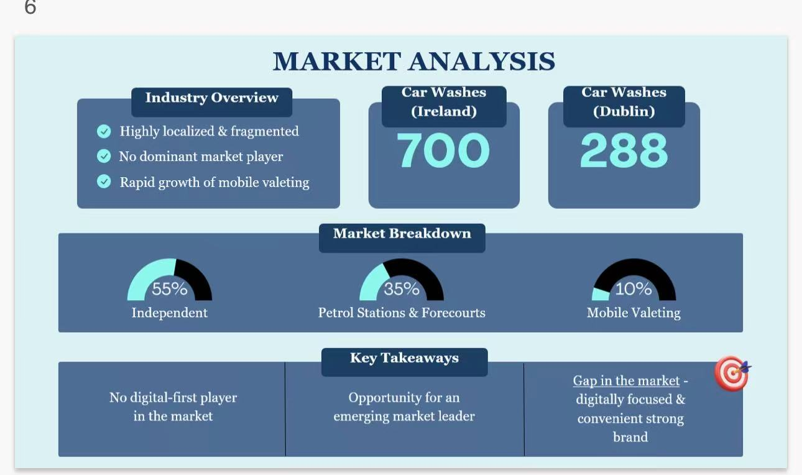
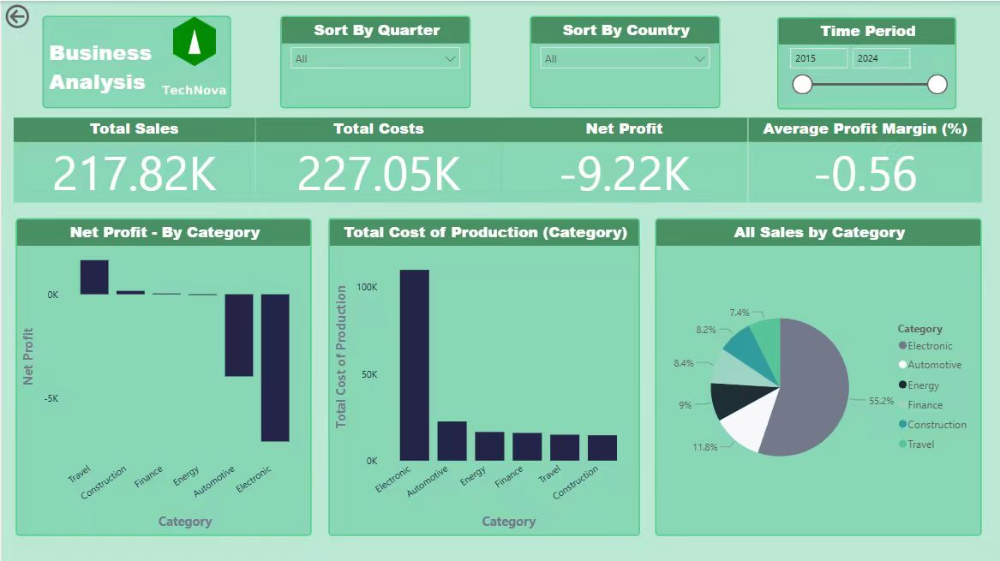
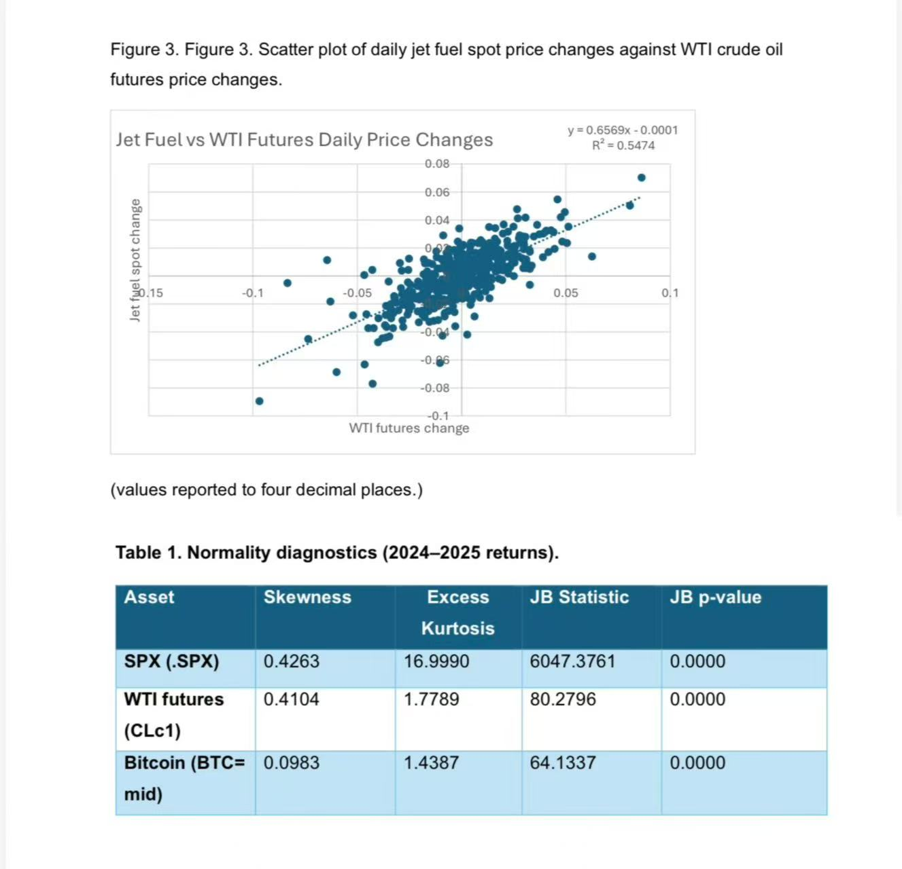

## Project Directory

A curated selection of academic and practical work that reflects my development in business analytics, marketing planning, business intelligence, and quantitative analysis.

::: {.project-listing}
::: {.project-entry}
{.project-thumb}

### Project 1 — Park & Polish

This project focuses on market analysis, structured business planning, and analytical thinking supported by Excel and SQL-informed logic.

[Open Project 1](project1_park_polish.qmd){.primary-btn .small-btn}
:::

::: {.project-entry}
{.project-thumb}

### Project 2 — Power BI

This project presents dashboard design, business storytelling, and performance visualisation using Power BI in a collaborative business context.

[Open Project 2](project2_power_bi.qmd){.primary-btn .small-btn}
:::

::: {.project-entry}
{.project-thumb}

### Project 3 — Risk Management

This project explores Excel-based quantitative work, risk measures, and hedging analysis through structured financial calculations and visual interpretation.

[Open Project 3](project3_risk_management.qmd){.primary-btn .small-btn}
:::
:::
