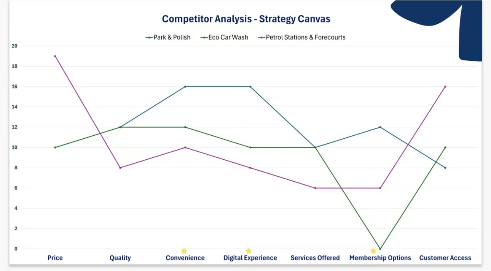

## Overview

This project focuses on Park Polish as a marketing analysis case study. I used the project to explore how a new service concept can be positioned in a fragmented market through structured comparison, customer convenience analysis, and competitor review. The work centred on identifying market opportunity, understanding customer needs, and examining how a digitally focused car care service could differentiate itself from more traditional alternatives. I also used Excel and structured analytical logic to organise comparisons clearly and support decision-making. This project represents the strategic and commercial side of my portfolio and shows how I can connect marketing thinking with evidence-based analysis.

## Reflection

This project helped me understand that marketing strategy is stronger when it is supported by structure and evidence rather than only creative ideas. By working on market comparison and competitor positioning, I became more confident in identifying a clear value proposition and explaining why a business idea may succeed in a specific market context. I also learned how to present commercial analysis in a more professional way, turning broad ideas into specific strategic conclusions. This project is important in my portfolio because it shows that I can think beyond theory and apply analytical reasoning to a practical business concept with a clear customer and market focus.

## Skills Gained

Through this project, I strengthened several useful skills. First, I improved my ability to use Excel to organise and compare business information clearly. Second, I developed stronger strategic thinking by breaking a market into categories such as competition, convenience, service offer, and positioning. Third, I practised structured analytical communication by presenting findings in a way that is concise and commercially relevant. Finally, this project strengthened my confidence in combining marketing analysis with data-informed logic. Even though it is not a purely technical project, it helped me develop an analytical mindset that supports business decision-making and portfolio presentation.
