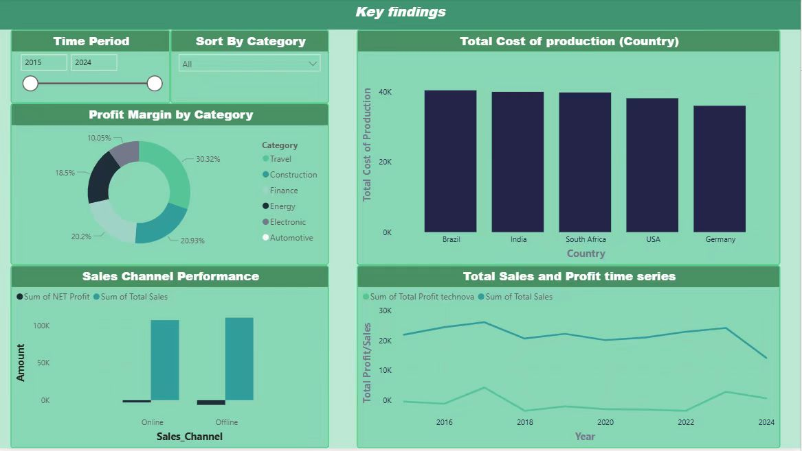

## Overview

This project presents a Business Intelligence analysis of TechNova using Microsoft Power BI. The aim was to turn business data into dashboard visuals that make performance easier to interpret across categories, regions, costs, and sales channels. I used this project to explore how visual analytics can support strategic understanding by highlighting patterns that may not be obvious in raw tables alone. The dashboard format helped present key indicators in a more accessible and management-oriented way. This project adds a strong visual and business intelligence dimension to my portfolio by showing how data can be transformed into professional dashboard communication and practical strategic insight.

## Reflection

This project helped me appreciate the importance of visual storytelling in business analysis. Instead of focusing only on calculations, I learned how layout, dashboard structure, and chart selection affect how clearly insights can be communicated. I became more aware that good analysis should not only be correct, but also easy for others to understand and use. Working with Power BI strengthened my ability to connect numbers with interpretation and to think about what information decision-makers need most. This project is important in my portfolio because it demonstrates that I can move from raw business data to a visual and professional presentation style that supports strategic discussion.

## Skills Gained

Through this project, I developed stronger Power BI and dashboard design skills. I improved my ability to organise performance indicators into a clear visual structure and to compare profitability, cost, and category performance in a meaningful way. I also strengthened my skills in business interpretation, because the dashboard required me to explain not only what the visuals show, but also why the patterns matter. Another skill gained was data storytelling: I learned how to present findings in a way that is visually clear, concise, and relevant to management decisions. Overall, this project strengthened both my technical BI capability and my confidence in communicating insights professionally.
