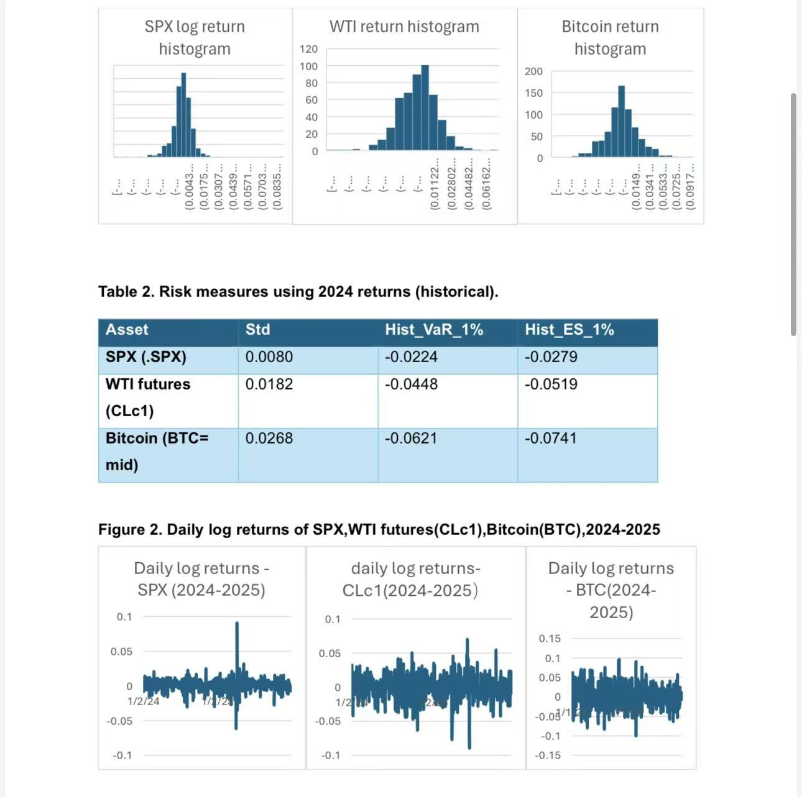
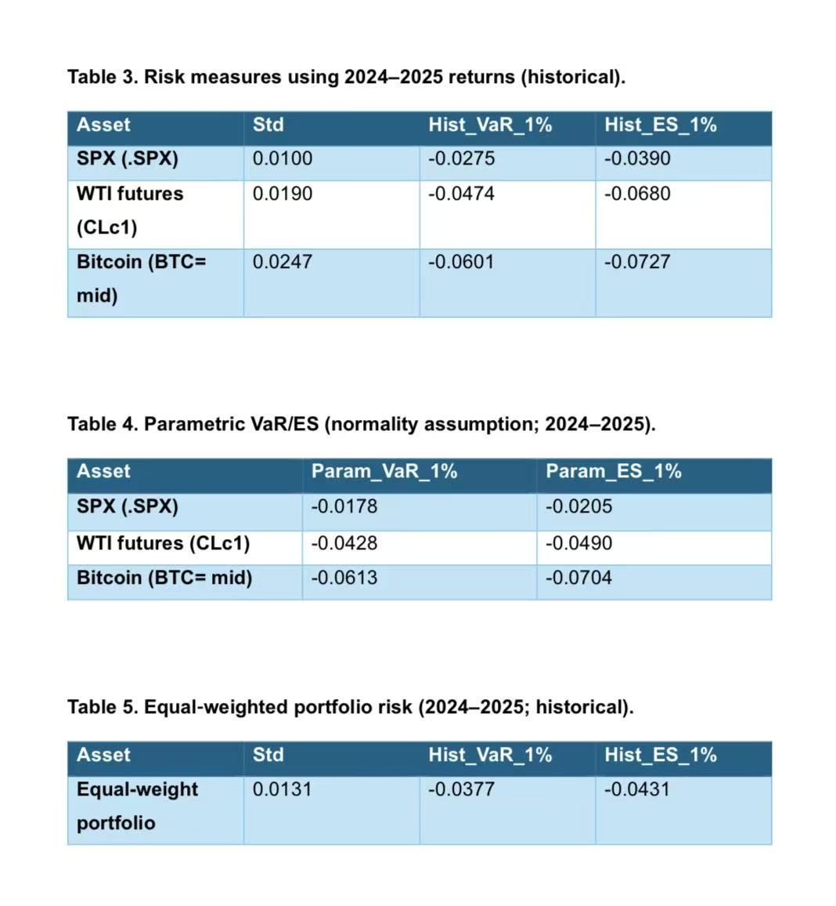

## Overview

This project focuses on quantitative risk analysis and hedging using Excel-based calculations and financial visualisation. It examines how different assets behave under risk and how quantitative measures can be used to compare volatility, downside exposure, and portfolio effects. I used this project to apply a more technical and numerical approach than in my other portfolio work. The project also explores hedging logic and shows how visual evidence can support financial interpretation. It represents the quantitative side of my portfolio and demonstrates that I can work with risk measures, structured calculations, and visual presentation in a disciplined and analytical way.

## Reflection

This project helped me develop a much deeper understanding of financial risk and the value of structured quantitative analysis. I learned that risk is not only about overall volatility, but also about downside exposure, portfolio interaction, and how different methods may produce different interpretations. Working through this project improved my confidence in handling more technical material and explaining it clearly. I also realised how important it is to connect calculations with interpretation, rather than presenting numbers without context. This project is valuable in my portfolio because it shows that I can work independently with analytical detail, financial reasoning, and visual evidence in a way that is both technical and understandable.

## Skills Gained

The main skills I gained from this project are Excel-based quantitative analysis, financial interpretation, and visual communication of technical results. I improved my use of Excel for structured calculations and became more confident in working with return-based measures, risk comparison, and numerical reasoning. I also strengthened my ability to interpret tables and charts in a meaningful way instead of treating them as isolated outputs. In addition, this project improved my confidence in explaining technical topics in a clearer and more professional format. Overall, it helped me show that I can combine spreadsheet skills, analytical thinking, and financial judgement within a portfolio setting.

